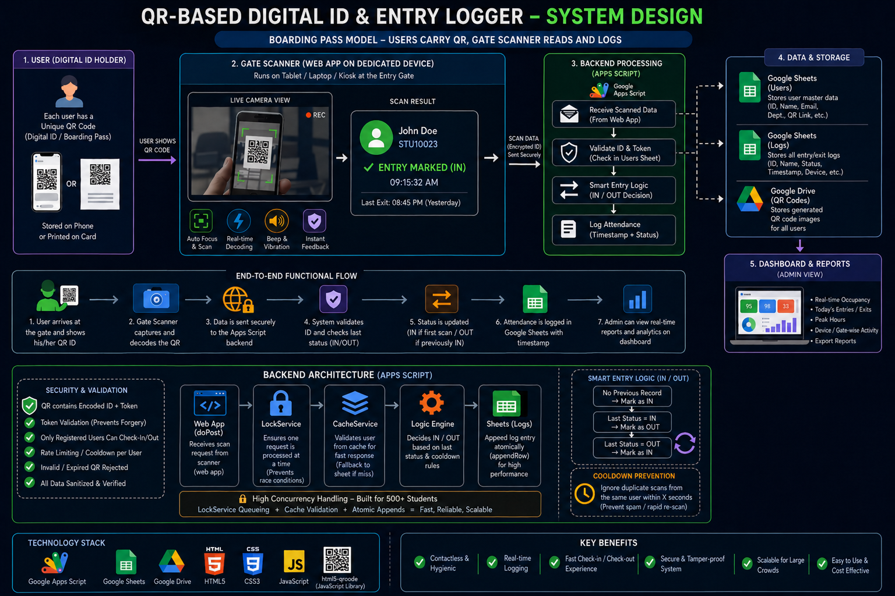

**QR Based Digital ID & Entry Logging System**

**Problem Statement**
Traditional biometric attendance and manual entry systems often face issues like slow processing, hardware dependency, maintenance costs, duplicate entries, and poor real-time visibility. This project is built to solve this by creating a **QR-powered Digital ID & Entry Logging System** where each user receives a unique QR code and every scan is validated and recorded instantly through a web-based scanner. The system replaces outdated attendance methods with a fast, scalable and admin-friendly solution.

**Features**
a) Core Features
- Unique QR Code generated for every registered user
- Web-based QR scanner using camera access
- Instant scan validation
- IN / OUT attendance toggle system
- Duplicate scan prevention using cooldown logic
- Real-time attendance logging into Google Sheets
- Invalid QR detection

b) Admin Features
- Live attendance dashboard
- Total registered users counter
- Currently IN users count
- Recent activity stream
- Register new users directly from dashboard
- Delete users instantly
- Auto QR generation for new users
- Searchable student registry

c) Advanced Features
- Queue-based background processing
- Batch write optimization
- Concurrency-safe scan handling
- Real-time status updates
- Lightweight cloud deployment

**TECH Stack**
a) Frontend
- HTML / CSS / JavaScript

b) Backend
- Google Apps Script

c) Database
- Google Sheets (Users + Logs + Admins)
- Google Drive (QR Storage)

d) Deployment
- Google Apps Script Web App
- Netlify (Scanner Camera Interface)

e) External APIs / Libraries
- QR Code Generation API
- HTML5 Camera Access

**Architecture Diagram**

**Workflow**

**Admin Dashboard Features**
a) Live Dashboard
- Currently IN users
- Total users
- System online status
- Recent activity stream
b) User Management
- Add new users
- Delete users
- Search users
- View QR status
c) QR Operations
- Generate missing QR codes
- Drive linked storage
d) Monitoring
- Real-time attendance visibility
- Fast refresh controls

**Deployment Links**
a) Appscript Project
b) Deployed Web App
c) Netlify Scanner
d) Google Sheet
e) Drive Folder
f) Github repository

**Folder Structure**
digital-id-system/
│── admin.html
│── scanner.html
│── Router.gs
│── CoreEngine.gs
│── BackWorker.gs
│── AdminCore.gs
│── IdentityGen.gs
│── config.gs
│── README.md

**Purpose of Files**
1. admin.html → Admin dashboard UI
2. scanner.html → User scanner landing page
3. Router.gs → Route control / page rendering
4. CoreEngine.gs → Main scan validation engine
5. BackWorker.gs → Queue processing worker
6. AdminCore.gs → Dashboard backend functions
7. IdentityGen.gs → QR generation logic
8. config.gs → Constants and IDs

**Challenges Faced**
1. Camera Permissions Restriction
2. Concurrent Delays
3. Google Sheets Write Delays
4. Duplicate Scans

